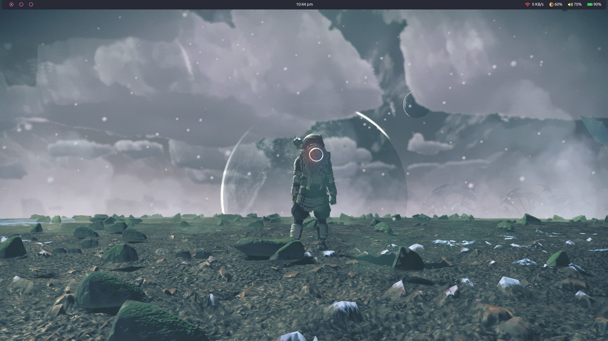
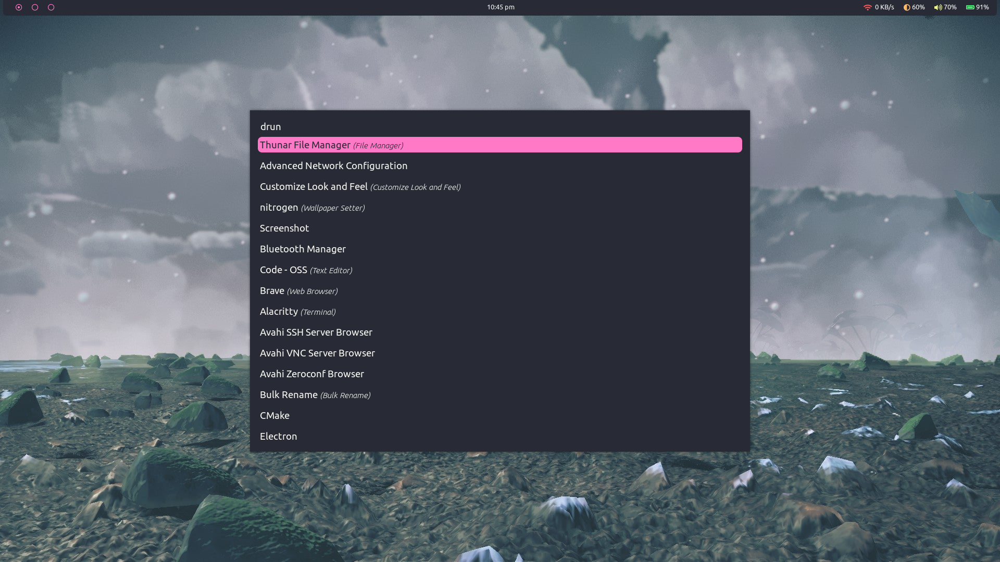
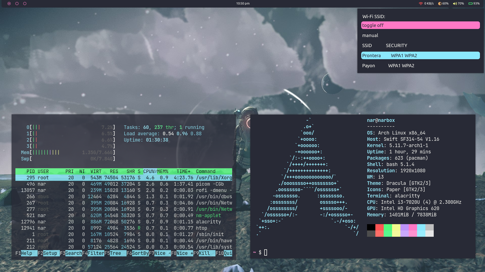
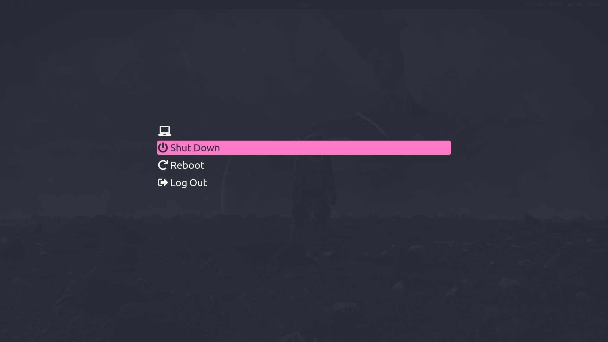

# dotfiles

Linux config files for my personal linux environment

## Config files for the following packages:

- alacritty
- awesome
- i3
- i3lock-color
- rofi
- dunst
- bash
- polybar

## Screenshots

### Desktop

### Rofi

### Open Windows + Wifi menu

### Power menu
